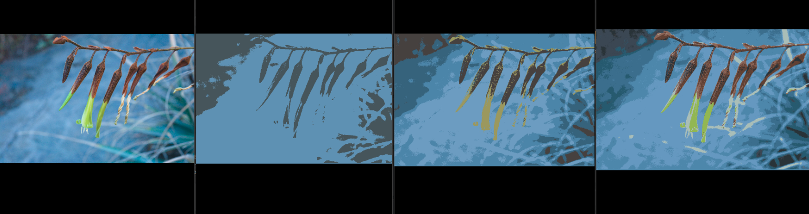

# Proyecto final de tópicos en computación gráfica
## Alumno:
- Mamani Mamani Yonel Yvan

## Título del paper:
- Image Segmentation using K-means Clustering Algorithm and Subtractive Clustering Algorithm


## Código fuente
```ssh
FINAL/seg.cu
```
## Ejecución
```ssh
  nvcc seg.cu -o m `pkg-config opencv --cflags --libs`
  ./m
```


## Tiempos
- Se uso una tarjeta grafica Nvidia GeForce GT 740m con 384 Núcleos CUDA.
- Se probó en una imagen de 2048x1336.

```
Número de centroides: 2	   Tiempo: 1.0494933333
Número de centroides: 5	   Tiempo: 1.3006466667
Número de centroides: 10      Tiempo: 1.77921
Número de centroides: 20      Tiempo: 2.7558633333
```

## Puebas
A continuacion se muestran: imagen original, 2 centroides, 5 centroides y 10 centroides respectivamente.





